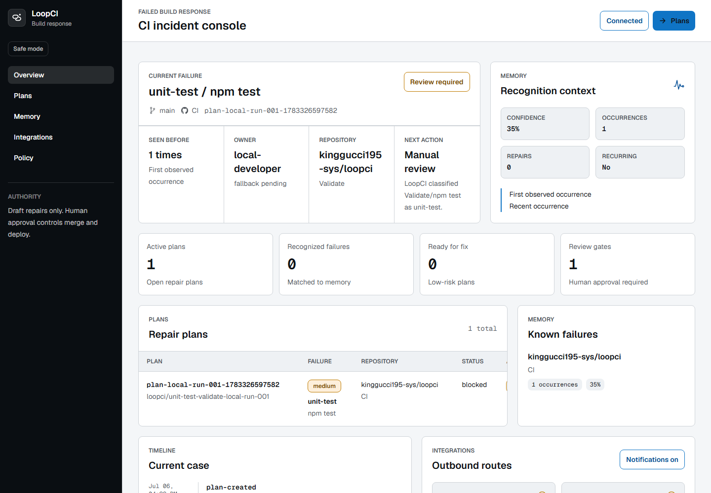
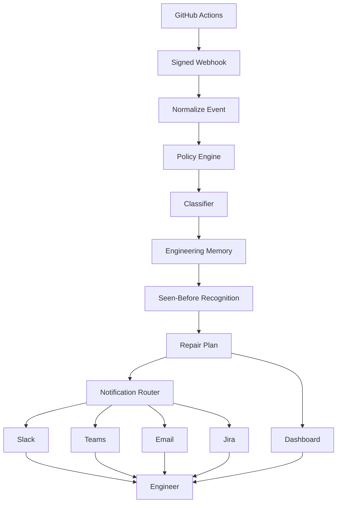

# LoopCI

When CI breaks, LoopCI already knows who should fix it.

LoopCI turns failed GitHub Actions runs into evidence-backed repair plans assigned to the likely owner. Instead of searching logs, GitHub Actions pages, and chat history, your team receives exactly what failed, why it failed, who owns it, and what to do next.

Every code change stays behind human approval.



## 30-Second Explanation

LoopCI is failed build response for engineering teams.

It is not another chatbot for CI logs. GitHub Actions detects the failure, Slack delivers messages, and Jira tracks work. LoopCI owns the operational workflow between them: policy, classification, ownership, evidence, routing, and human review.

## Why LoopCI Exists

Every engineering team eventually asks the same questions after a failed build:

- Who owns this?
- Is it safe to fix automatically?
- Is this flaky or real?
- Has this happened before?
- What evidence should I review?

LoopCI answers those questions automatically.

## How It Works

```text
CI fails
-> Webhook received
-> Event normalized
-> Policy applied
-> Failure classified
-> Memory checked for prior fixes
-> Owner identified
-> Repair plan generated
-> Notification routed
-> Human approves risky changes
```

## Why Not Just GitHub Actions?

| GitHub Actions                      | LoopCI                                                 |
| ----------------------------------- | ------------------------------------------------------ |
| Reports that a workflow failed      | Explains why it likely failed                          |
| Sends generic failure notifications | Routes the repair plan to the likely owner             |
| Shows raw logs                      | Produces an evidence-backed repair plan                |
| Has no risk evaluation              | Separates low-risk fixes from review-gated failures    |
| Leaves coordination to people       | Sends Slack, Teams, email, Jira, and dashboard updates |

## Example Repair Card

```text
Repository: payment-service
Owner: @justin
Failure: typecheck
Risk: low
Confidence: 94%
Likely cause: Prisma client types are stale after a schema change.
Suggested action: Regenerate Prisma client and rerun typecheck.
Evidence: Type mismatch introduced in commit abc123.
Review: Safe to request an automated patch; merge still requires approval.
```

## Architecture



## Features

Integrations:

- GitHub Actions failure webhooks.
- Slack repair cards.
- Microsoft Teams repair cards.
- SMTP and Gmail-compatible email notifications.
- Jira issue creation for repair plans.

Workflow:

- Repository and branch policy enforcement.
- Deterministic failure classification with optional OpenAI classification.
- Engineering Memory Engine v1 with exact "seen before" recognition.
- Repair plans with likely owner, risk, confidence, evidence, and next action.
- CODEOWNERS-aware ownership with actor routing through `loopci.notifications.json`.
- Webhook delivery ledger with duplicate suppression, dead-letter records, and protected operational metrics.
- Safe "Fix this error" confirmation route for low-risk repair work.

Design principles:

- Humans approve every code change.
- Policy overrides AI.
- Deterministic checks come before model output.
- Every recommendation includes evidence.
- Integrate with existing engineering workflows instead of replacing them.
- Optimize for trust before autonomy.

## Quick Start

```bash
npm install
npm run typecheck
npm run lint
npm test
npm run build
```

Run locally:

```bash
npm run dev
```

Run with Docker:

```bash
docker compose up --build
```

## Docs

- [Product positioning](docs/product-positioning.md)
- [Product execution plan](docs/product-plan.md)
- [Engineering Memory Engine](docs/engineering-memory.md)
- [Architecture decision: event source of truth](docs/architecture-decisions/ADR-001-event-source-of-truth.md)
- [GitHub install guide](docs/install-github.md)
- [Integrations guide](docs/integrations.md)
- [Production runbook](docs/production.md)
- [Security model](docs/security.md)
